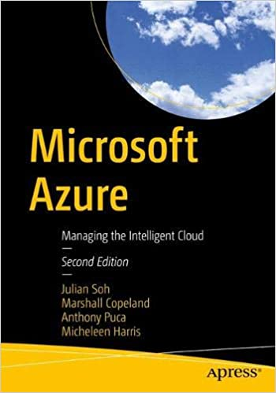

# Julian Soh
[Connect via LinkedIn](https://www.linkedin.com/in/juliansoh/?lipi=urn%3Ali%3Apage%3Ad_flagship3_feed%3Bl6xFDO%2B8SN6dzX8GJqKL7w%3D%3D){:target="_blank"}.
## About
I work with customers to help transform their business through the adoption of emerging technologies in Microsoft Azure, specifically around Big Data, IoT, Artificial Intelligence, and Advanced Analytics. My career at Microsoft spans across many products and services, covering technologies that used to be on-premises (e.g. Windows Server and Tools, Office, SharePoint), Microsoft's first public cloud (Office 365 SaaS), Microsoft Azure as IaaS/PaaS, and currently the Data, A.I. and Cognitive Services capabilities in Azure. As part of the Customer Success Unit, I work with Microsoft's public sector customers to improve communities and public safety through the ethical adoption of A.I. in Azure.
## Latest development
Please share your ideas and in the meantime, check out my latest book - [Microsoft Azure, 2nd Edition. Managing the Intelligent Cloud](https://www.amazon.com/Microsoft-Azure-Managing-Intelligent-Cloud/dp/1484259572/){:target="_blank"}. We developed and collected a lot of material for this book in order to extend beyond its physical covers and to keep pace with updates by creating a [dedicated GitHub repo for the book](https://harris-soh-copeland-puca.github.io){:target="_blank"}.

